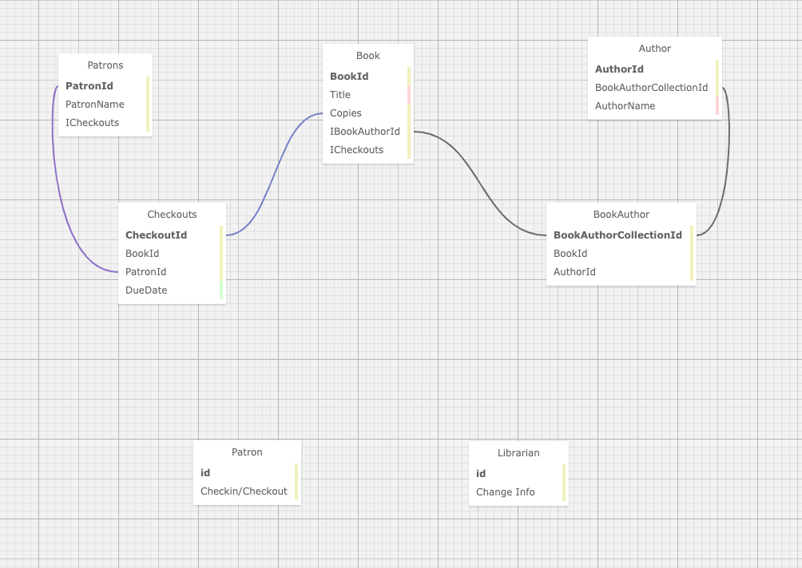

# _Library_

#### _C#/.NET Project for [Epicodus](https://www.epicodus.com/), 2020.08.07_

#### By **Evgenya Chernaya and Thomas Glenn**

<h1 align='center'><br>

## Description
A daily project for Epicodus school, which allows the librarian to add, edit, delete, checkin and checkout books. This project demonstrates many-to-many-many database relationships. 


The following sitemap explains this database query relationship between Books, Authors, and Patrons in this schema.

## Database Structure


## Specifications

| Spec | Input | Output | 
|:--------- |:--------- |:-------- |
| The program will construct a database of Authors allowing the Librarian to make entries | "Name" | "Charles Dickens" | 
| The program will construct a database of Books allowing the Librarian to make entries | "Title"  | "Great Expectations" |
| The program will allow the Librarian to view lists of Authors | "View Authors List" | "Charles Dickens", "Alexander Pushkin" |
| The program will allow the Librarian to view lists of Books |  "View List of Books" | "Great Expectations", "Evgeny Onegin" |
| The Program will allow the Librarian to add Patrons to the database | "Add Patron" | "Dennis Hopper" |
| The program will allow the Librarian to edit entries | "Grate Expirations" | "Great Expectations" |
| The program will allow the Librarian to delete entries | "George Burns" | " " | 

## Known Bugs
* No known bugs.   

## Setup/Installation Requirements
#### View Online
Visit the GitHub Pages by clicking on the following link or by typing it in your web browser. 
<url:>

https://github.com/thomasglenngit/Library.Solution

#### View locally

*[.NET Core](https://dotnet.microsoft.com/download/dotnet-core/2.2) is needed to run this application*

To clone this repository from your command line you will need [Git](https://git-scm.com/) installed. 

First navigate in the command line to where you want to clone this repository. 

Then from your command line run:

`$ git clone `

Once the repository has been cloned, navigate to the to the application directory and run `$ dotnet restore`.
Once 'restore' is run, enter `$ dotnet build`.

#### MySQL Setup
In order to view and use the functionality of this project you must,
1. Install MySQL on your computer. If you don't have it, you can download the .dmg file here:
https://dev.mysql.com/downloads/file/?id=484914. You'll need to create a password.

2. Install MySQL Workbench on your computer. If you don't have it, you can download it here:
https://dev.mysql.com/downloads/file/?id=484391.

3. Open MySQL Workbench and select the Local instance 3306 server. 

#### Importing this file:
1. Open your MySQL Workbench. In the Navigator > Administration window, select Data Import/Restore.

2. In Import Options select Import from Self-Contained File.

3. Navigate to `library`.

Under Default Schema to be Imported To, select the New button.

Enter the name of your database with _test appended to the end.
In this case library_test.
Click Ok.
Click Start Import.

Reopen the Navigator > Schemas tab. Right click and select Refresh All. Our new test database will appear.

#### Query
The following is the query information for access this database on MySQL Workbench.
```
CREATE DATABASE `library` /*!40100 DEFAULT CHARACTER SET utf8mb4 COLLATE utf8mb4_0900_ai_ci */;
CREATE TABLE `Authors` (
  `AuthorId` int(11) NOT NULL AUTO_INCREMENT,
  `Name` longtext,
  `UserId` varchar(255) DEFAULT NULL,
  PRIMARY KEY (`AuthorId`),
  KEY `IX_Authors_UserId` (`UserId`),
  CONSTRAINT `FK_Authors_AspNetUsers_UserId` FOREIGN KEY (`UserId`) REFERENCES `aspnetusers` (`Id`) ON DELETE RESTRICT
) ENGINE=InnoDB AUTO_INCREMENT=4 DEFAULT CHARSET=utf8mb4 COLLATE=utf8mb4_0900_ai_ci;
CREATE TABLE `Books` (
  `BookId` int(11) NOT NULL AUTO_INCREMENT,
  `Title` longtext,
  `Copies` int(11) NOT NULL,
  `UserId` varchar(255) DEFAULT NULL,
  PRIMARY KEY (`BookId`),
  KEY `IX_Books_UserId` (`UserId`),
  CONSTRAINT `FK_Books_AspNetUsers_UserId` FOREIGN KEY (`UserId`) REFERENCES `aspnetusers` (`Id`) ON DELETE RESTRICT
) ENGINE=InnoDB AUTO_INCREMENT=6 DEFAULT CHARSET=utf8mb4 COLLATE=utf8mb4_0900_ai_ci;
CREATE TABLE `BooksAuthors` (
  `BookAuthorId` int(11) NOT NULL AUTO_INCREMENT,
  `AuthorId` int(11) NOT NULL,
  `BookId` int(11) NOT NULL,
  PRIMARY KEY (`BookAuthorId`),
  KEY `IX_BooksAuthors_AuthorId` (`AuthorId`),
  KEY `IX_BooksAuthors_BookId` (`BookId`),
  CONSTRAINT `FK_BooksAuthors_Authors_AuthorId` FOREIGN KEY (`AuthorId`) REFERENCES `authors` (`AuthorId`) ON DELETE CASCADE,
  CONSTRAINT `FK_BooksAuthors_Books_BookId` FOREIGN KEY (`BookId`) REFERENCES `books` (`BookId`) ON DELETE CASCADE
) ENGINE=InnoDB AUTO_INCREMENT=4 DEFAULT CHARSET=utf8mb4 COLLATE=utf8mb4_0900_ai_ci;
CREATE TABLE `Checkouts` (
  `CheckoutId` int(11) NOT NULL AUTO_INCREMENT,
  `DueDate` datetime(6) NOT NULL,
  `PatronId` int(11) NOT NULL,
  `BookId` int(11) NOT NULL,
  PRIMARY KEY (`CheckoutId`),
  KEY `IX_Checkouts_BookId` (`BookId`),
  KEY `IX_Checkouts_PatronId` (`PatronId`),
  CONSTRAINT `FK_Checkouts_Books_BookId` FOREIGN KEY (`BookId`) REFERENCES `books` (`BookId`) ON DELETE CASCADE,
  CONSTRAINT `FK_Checkouts_Patrons_PatronId` FOREIGN KEY (`PatronId`) REFERENCES `patrons` (`PatronId`) ON DELETE CASCADE
) ENGINE=InnoDB DEFAULT CHARSET=utf8mb4 COLLATE=utf8mb4_0900_ai_ci;
CREATE TABLE `Patrons` (
  `PatronId` int(11) NOT NULL AUTO_INCREMENT,
  `Name` longtext,
  `UserId` varchar(255) DEFAULT NULL,
  PRIMARY KEY (`PatronId`),
  KEY `IX_Patrons_UserId` (`UserId`),
  CONSTRAINT `FK_Patrons_AspNetUsers_UserId` FOREIGN KEY (`UserId`) REFERENCES `aspnetusers` (`Id`) ON DELETE RESTRICT
) ENGINE=InnoDB DEFAULT CHARSET=utf8mb4 COLLATE=utf8mb4_0900_ai_ci;

```

### Edit
* To view and edit the code, open the application in your preferred code editor, such as Visual Studio Code.

## Technologies Used
* Visual Studio Code (code editor)
* C#/.NET
* GitHub
* MSTests
* MacOS Catalina
* MySQL Workbench
* CSS
* .html

# **❤️Contributors**

| [<br /><sub><b>Evgeniya Chernaya</b></sub>](https://www.linkedin.com/in/evgeniyach/)<br />

<br>

<br>

![alt text][logo]

[logo]: https://img.shields.io/bower/l/bootstrap 'MIT License'


